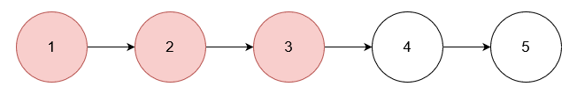
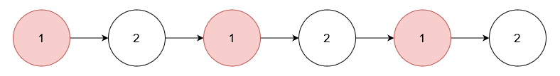
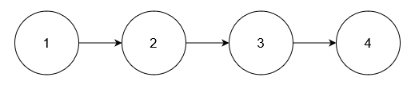

## **3217. Delete Nodes From Linked List Present in Array**

**Medium**

You are given an array of integers nums and the head of a linked list. Return the head of the modified linked list after removing all nodes from the linked list that have a value that exists in nums.

Example 1:

Input: nums = [1,2,3], head = [1,2,3,4,5]

Output: [4,5]

Explanation:

Remove the nodes with values 1, 2, and 3.

Example 2:

Input: nums = [1], head = [1,2,1,2,1,2]

Output: [2,2,2]

Explanation:

Remove the nodes with value 1.

Example 3:

Input: nums = [5], head = [1,2,3,4]

Output: [1,2,3,4]

Explanation:

No node has value 5.